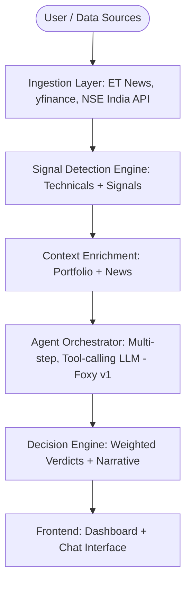
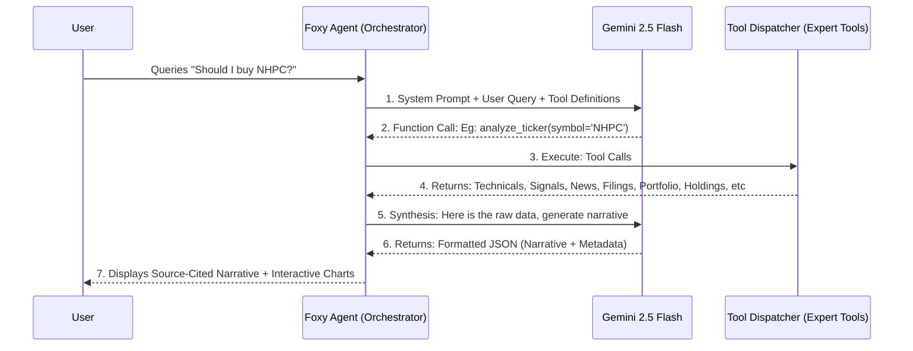

# 🚀 DECIXN — The Intelligence Layer for Retail Investors

<div align="center">
  
  
  
</div>

<p align="center">
  <b>DECIXN is a full-stack decision intelligence system designed for the modern Indian retail investor.</b><br/>
  While India has 14+ crore demat accounts, most investors operate blindly — reacting to tips, missing filings, and making decisions based on gut feel. <br/>
  <b>DECIXN tells you what to do with the data.</b>
</p>

---

## 🔗 Live Demo & Connectivity

| Platform            | URL                                                                                       |
| :------------------ | :---------------------------------------------------------------------------------------- |
| **🌐 Web Frontend** | [decixn-et-gen-ai-hackathon.netlify.app](https://decixn-et-gen-ai-hackathon.netlify.app/) |
| **⚙️ Backend API**  | [thegangetgenaihackathon.onrender.com](https://thegangetgenaihackathon.onrender.com)      |
| **📖 Swagger Docs** | [Backend Endpoint/docs](https://thegangetgenaihackathon.onrender.com/docs)                |

> [!WARNING]
> **Cold Start Alert**: The backend is hosted on Render's free tier. The first request may take **1–2 minutes** to wake up.

---

## 🏗️ System Architecture

DECIXN is built as an orchestrated ecosystem of specialized engines.



---

## 🤖 Agentic Lifecycle (Foxy v1)

Foxy follows a strict **Detect → Enrich → Act** pipeline to ensure signal quality over simple summarization.



---

---

## 🧭 Navigation & API Intelligence Cell

To provide transparency into the platform's multi-layered intelligence, every route and endpoint is documented below.

### 📱 Full Frontend Page Matrix

| Category | Route | Intelligence Description |
| :--- | :--- | :--- |
| **📈 Stocks** | `/stocks/holdings` | Portfolio health, trend-following, and capital classification. |
| | `/stocks/explore` | Real-time indices, market movers, and sector performance. |
| | `/stocks/insights` | Technical diagnostics and anomaly detection signals. |
| | `/stocks/news` | AI-scored catalyst feed with sentiment weights. |
| | `/stocks/watchlist` | High-frequency quote tracking with mini-sparklines. |
| | `/stocks/alerts` | Risk threshold & price-action management. |
| | `/stocks/details/:ticker` | Deep investigative view for specific Indian equities. |
| | `/terminal/:ticker` | Logic-dense HUD with interactive Technical Terminal & Predictive Bands. |
| **🏦 MFs** | `/mutual-funds/holdings` | Mutual Fund specific portfolio health & asset distribution. |
| | `/mutual-funds/insights` | Fund-specific risk metrics (Beta, Sharpe, Expense Ratios). |
| | `/mutual-funds/compare` | Multi-fund side-by-side comparison portal. |
| | `/mutual-funds/details/:id` | NAV history, AMC info, and risk-profile investigation. |
| **🤖 AI & Sync** | `/chat` | **Foxy v1** — Agentic Financial Co-pilot Interface. |
| | `/notifications` | Live Alert Inbox for triggered risk thresholds. |
| | `/info/portfolio` | Security & context reference for user asset data. |
| | `/login` | Secure authentication portal (Supabase). |

### ⚡ Comprehensive API Endpoints

| Cell | Endpoint | Logic Provided |
| :--- | :--- | :--- |
| **Stocks** | `GET /analyze/{ticker}` | Full multi-turn Technical/Signal engine report. |
| | `GET /market/overview` | Core market benchmarks and volatility movers. |
| | `GET /analyze/forecast/{t}` | ATR-weighted volatility & price range prediction. |
| | `GET /opportunity-radar` | Corporate actions, dividends, and insider/block deals. |
| | `POST /quotes/batch` | Async batch quotes with sparkline generation. |
| | `GET /search/{query}` | Real-time Indian equity autocomplete engine. |
| **MFs** | `GET /mf/search` | Mutual Fund scheme search & ISIN mapping. |
| | `POST /mf/analyze/portfolio` | Risk-weighted MF health check & exit-load audit. |
| | `GET /mf/details/{id}` | Cumulative fund history & scheme-level intel. |
| | `POST /mf/analyze/insights` | Deep-tier portfolio overlap & performance analytics. |
| | `GET /mf/compare` | Parallel fund benchmark comparison. |
| **Agent** | `POST /chat` | Streaming, stateful, tool-calling Agent Interface. |
| | `GET /chat/status/{id}` | Token limit & request rate status monitoring. |
| | `GET /chat/sessions/{id}` | Session-ID catalog for multi-threaded history. |
| | `GET /chat/history/{id}` | Recursive session message retrieval. |
| | `DELETE /chat/sessions/{id}`| Thread termination & data cleanup. |
| **Risk** | `POST /alerts` | Threshold creation (Technical/Price/Volume). |
| | `GET /alerts/{id}` | Active risk-monitoring registry. |
| | `PATCH /alerts/{id}` | Real-time toggle for monitoring active state. |
| | `GET /notifications/{id}` | Trigger audit log & alert history. |
| | `POST /alerts/run` | Manual trigger for the Alert Evaluation Engine. |

---

## ⚙️ Engineering Setup & Deployment

### 1. One-Step Installation

```bash
# Clone the unified DECIXN repository
git clone https://github.com/Pratt1702/DECIXN.git && cd DECIXN

# Install Frontend & Backend Dependencies
npm install && cd frontend && npm install && cd ../backend && pip install -r requirements.txt && cd ..
```

> [!TIP]
> **Sample Data for Testing**: Use the files in the `test_data/` directory (specifically `stocks/` and `mfs/` subfolders) for immediate portfolio uploads. If using custom CSVs, ensure you follow the structure defined in the **[Portfolio Format Reference](file:///info/portfolio)** link within the app.

### 2. Required Environment Variables (.env)

You will need keys for **Supabase** (Auth/DB) and **Google Gemini** (LLM).

**Frontend** `./frontend/.env`:

- `VITE_SUPABASE_URL`
- `VITE_SUPABASE_PUBLISHABLE_KEY`
- `VITE_GEMINI_KEY`

**Backend** `./backend/.env`:

- `SUPABASE_URL`
- `SUPABASE_SERVICE_ROLE_KEY`
- `GEMINI_API_KEY`

### 3. Supabase Database Setup

To initialize the database schema, functions, and RLS policies:

1. Open your **Supabase Project Dashboard**.
2. Navigate to the **SQL Editor** in the left sidebar.
3. Create a **New Query**.
4. Copy the entire contents of **[supabase_schema.sql](supabase_schema.sql)** and paste them into the editor.
5. Click **Run**.
6. (Optional) Run the Mutual Fund sync once via API `POST /mf/sync?only_update=false` to populate the initial catalog.

### 4. Testing Credentials

For quick evaluation, you can use the following test account:

- **Email**: `testaccount@gmail.com`
- **Password**: `test123`

### 5. Execution

```bash
# Start both Frontend and Backend concurrently
npm run dev
```

---

## 🎯 Alignment & Impact

DECIXN directly solves the **"Blind Investor" problem** outlined in the ET GenAI Track 6:

- **Signal over News**: Moves beyond "summaries" to detect real insider activity and corporate filings.
- **Portfolio-Aware**: Every insight is contextualized to your specific holdings (Zerodha/Groww CSV).
- **Behavioral Rescue**: Explicitly flags "Trapped Capital" in bearish assets to reduce emotional loss-holding.
- **Engineering Depth**: Replaces standard RAG with a custom sequential reasoning agent (Foxy).

> [!TIP]
> **Explore the Full Matrix**: See the [capability matrix](features_list.md) for a deep dive into the 30+ atomic features that power DECIXN.

---

_Built for the ET Markets GenAI Hackathon._
