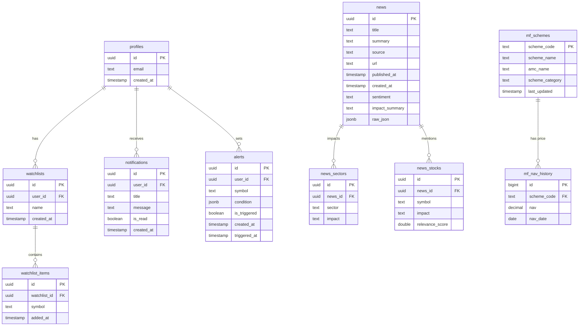

# Database Schema

This document outlines the database schema for the **ETGenAIHackathon** project. The schema is designed to manage user profiles, watchlists, market news (with sector and stock impact), notifications, and user-defined alerts.

## Entity Relationship Diagram

---

## Table Definitions

### `profiles`
Stores user profile information. Linked to `auth.users` in the authentication provider.

| Column | Type | Constraints | Description |
| :--- | :--- | :--- | :--- |
| `id` | `uuid` | `PK`, `FK` | Unique identifier (matches `auth.users.id`). |
| `email` | `text` | | User's email address. |
| `created_at` | `timestamp` | `DEFAULT now()` | Timestamp when the profile was created. |

### `watchlists`
User-created lists to track multiple stocks.

| Column | Type | Constraints | Description |
| :--- | :--- | :--- | :--- |
| `id` | `uuid` | `PK`, `DEFAULT gen_random_uuid()` | Unique identifier for the watchlist. |
| `user_id` | `uuid` | `FK (profiles.id)` | Owner of the watchlist. |
| `name` | `text` | `NOT NULL` | Name of the watchlist. |
| `created_at` | `timestamp` | `DEFAULT now()` | Creation timestamp. |

### `watchlist_items`
Individual stocks/tickers within a watchlist.

| Column | Type | Constraints | Description |
| :--- | :--- | :--- | :--- |
| `id` | `uuid` | `PK`, `DEFAULT gen_random_uuid()` | Unique identifier. |
| `watchlist_id` | `uuid` | `FK (watchlists.id)` | Parent watchlist. |
| `symbol` | `text` | `NOT NULL` | Stock ticker symbol (e.g., AAPL). |
| `added_at` | `timestamp` | `DEFAULT now()` | When the item was added. |

### `news`
Aggregated financial news records.

| Column | Type | Constraints | Description |
| :--- | :--- | :--- | :--- |
| `id` | `uuid` | `PK`, `DEFAULT gen_random_uuid()` | Unique identifier. |
| `title` | `text` | | Article headline. |
| `summary` | `text` | | AI-generated or source-provided summary. |
| `source` | `text` | | News outlet name. |
| `url` | `text` | | Link to the original article. |
| `published_at`| `timestamp` | | Original publication time. |
| `created_at` | `timestamp` | `DEFAULT now()` | Ingestion timestamp. |
| `sentiment` | `text` | | Overall sentiment (e.g., Bullish, Bearish). |
| `impact_summary`| `text` | | Brief summary of potential market impact. |
| `raw_json` | `jsonb` | | Complete raw data from the provider. |

### `news_sectors`
Mapping of news articles to affected market sectors.

| Column | Type | Constraints | Description |
| :--- | :--- | :--- | :--- |
| `id` | `uuid` | `PK`, `DEFAULT gen_random_uuid()` | Unique identifier. |
| `news_id` | `uuid` | `FK (news.id)` | Associated news article. |
| `sector` | `text` | | Impacted sector name. |
| `impact` | `text` | | Type of impact (e.g., High, Low). |

### `news_stocks`
Mapping of news articles to specific stock symbols.

| Column | Type | Constraints | Description |
| :--- | :--- | :--- | :--- |
| `id` | `uuid` | `PK`, `DEFAULT gen_random_uuid()` | Unique identifier. |
| `news_id` | `uuid` | `FK (news.id)` | Associated news article. |
| `symbol` | `text` | `NOT NULL` | Stock ticker symbol. |
| `impact` | `text` | | Predicted impact direction. |
| `relevance_score`| `double` | | Logic-based relevance to the article. |

### `notifications`
Alerts and messages sent to users.

| Column | Type | Constraints | Description |
| :--- | :--- | :--- | :--- |
| `id` | `uuid` | `PK`, `DEFAULT gen_random_uuid()` | Unique identifier. |
| `user_id` | `uuid` | `FK (profiles.id)` | Recipient user. |
| `title` | `text` | | Notification title. |
| `message` | `text` | | Full message content. |
| `is_read` | `boolean` | `DEFAULT false` | Read status. |
| `created_at` | `timestamp` | `DEFAULT now()` | Timestamp. |

### `alerts`
Custom user-defined price or condition alerts.

| Column | Type | Constraints | Description |
| :--- | :--- | :--- | :--- |
| `id` | `uuid` | `PK`, `DEFAULT gen_random_uuid()` | Unique identifier. |
| `user_id` | `uuid` | `FK (profiles.id)` | Owner of the alert. |
| `symbol` | `text` | `NOT NULL` | Target stock symbol. |
| `condition` | `jsonb` | `NOT NULL` | Logic for triggering the alert. |
| `is_triggered` | `boolean` | `DEFAULT false` | Current status. |
| `created_at` | `timestamp` | `DEFAULT now()` | Alert creation time. |
| `triggered_at` | `timestamp` | | Most recent trigger time. |

### `chat_history`
Persisted chatbot conversations and session metadata.

| Column | Type | Constraints | Description |
| :--- | :--- | :--- | :--- |
| `id` | `uuid` | `PK`, `DEFAULT gen_random_uuid()` | Unique identifier for the message. |
| `user_id` | `uuid` | `FK (profiles.id)`, `NOT NULL` | Message owner. |
| `session_id` | `uuid` | `NOT NULL`, `DEFAULT random` | Groups messages into a single chat. |
| `role` | `text` | `CHECK (role IN ('user', 'assistant'))` | Message source. |
| `content` | `text` | `NOT NULL` | Textual content. |
| `metadata` | `jsonb` | `DEFAULT '{}'` | Extracted tickers, charts, sentiment. |
| `created_at` | `timestamp` | `DEFAULT now()` | Sent timestamp. |

### `mf_schemes`
The central registry for all Indian mutual fund schemes (sourced from AMFI).

| Column | Type | Constraints | Description |
| :--- | :--- | :--- | :--- |
| `scheme_code` | `text` | `PK` | Unique AMFI scheme identifier. |
| `scheme_name` | `text` | `NOT NULL` | Full name of the fund. |
| `amc_name` | `text` | | Name of the Asset Management Company. |
| `scheme_category`| `text` | | Fund category (e.g., Equity: Large Cap). |
| `last_updated` | `timestamp` | | Time of last regulatory sync. |

### `mf_nav_history`
Historical price (NAV) data for mutual funds.

| Column | Type | Constraints | Description |
| :--- | :--- | :--- | :--- |
| `id` | `bigint` | `PK` | Unique record identifier. |
| `scheme_code` | `text` | `FK (mf_schemes)` | Associated scheme. |
| `nav` | `decimal` | `NOT NULL` | Net Asset Value on the given date. |
| `nav_date` | `date` | `NOT NULL` | The date for which NAV is recorded. |

### `portfolios`
Manual and persistent user holdings for Stocks and Mutual Funds.

| Column | Type | Constraints | Description |
| :--- | :--- | :--- | :--- |
| `id` | `uuid` | `PK`, `DEFAULT gen_random_uuid()` | Unique holding identifier. |
| `user_id` | `uuid` | `FK (profiles.id)`, `NOT NULL` | The owner of the holding. |
| `symbol` | `text` | `NOT NULL` | Ticker (e.g., RELIANCE.NS) or Scheme Code. |
| `asset_type` | `text` | `CHECK (asset_type IN ('stock', 'mf'))` | Type of asset. |
| `quantity` | `double precision` | `NOT NULL` | Number of units held. |
| `avg_cost` | `double precision` | `NOT NULL` | Average buy price per unit. |
| `isin` | `text` | | International Securities Identification Number (for MFs). |
| `created_at` | `timestamp` | `DEFAULT now()` | Record creation time. |

---

> [!NOTE]
> This schema is primarily managed via a Supabase-compatible PostgreSQL backend. Foreign keys are enforced at the database level to ensure data integrity.
