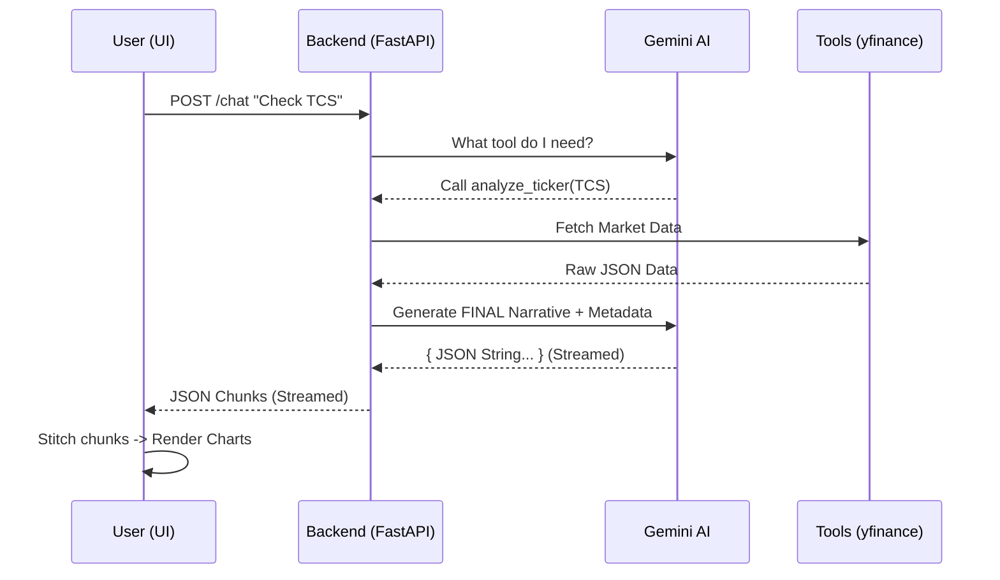

# Foxy Chatbot: Low-Level Orchestration Guide

This document explains exactly how the "Foxy" chatbot works, from the moment a user types a message to the rendering of interactive charts.

## 1. The Entry Point (Frontend)
When you type a message in `Chat.tsx`, the `handleSend()` function is triggered.

```typescript
// Chat.tsx
const handleSend = async () => {
  // 1. Add User Message to local state
  // 2. Add an "Assistant" message with 'loading' status
  // 3. POST to http://localhost:8000/chat
  const response = await fetch("http://localhost:8000/chat", {
    method: "POST",
    headers: { "Content-Type": "application/json" },
    body: JSON.stringify({ message: input, history: ..., context: ... })
  });
};
```

## 2. The Backend Bridge (`main.py`)
FastAPI receives the request and immediately delegates it to the `ChatEngine`. Because we use `StreamingResponse`, the connection stays open.

```python
# main.py
@app.post("/chat")
async def chat_endpoint(request: ChatRequest):
    # Returns a generator that yields text chunks
    return StreamingResponse(
        chat_engine.get_response(request.message, request.history, request.context),
        media_type="text/event-stream"
    )
```

## 3. The Brain Orchestration (`chat_service.py`)
This is where the magic happens. We use the **Google GenAI SDK** with **Tool Use**.

- **Phase 1: Tool Selection (Synchronous)**: Gemini evaluates if it needs a tool. We wait for this decision.
- **Phase 2: Execution (Synchronous)**: `ChatEngine` runs the tool (e.g., `yfinance`). This is local and fast, but we must wait for the data.
- **Phase 3: Final Response (STREAMED)**: Only now do we send everything (History + Tool Result) for the final pass. The narrative text is then streamed back to the frontend chunk-by-chunk.

> [!NOTE]
> We technically call the Gemini API twice if a tool is needed. This is standard for "Function Calling" to ensure the narrative is grounded in the tool's data.

## 4. Streaming & Concurrency
How is it streamed? We use **FastAPI's `StreamingResponse`** which leverages Python generators (`yield`).

```python
# chat_service.py
async def get_response(self, ...):
    yield {"status": "Thinking..."}
    # ... after tool execution ...
    for chunk in final_response:
        yield self._parse_json_response(chunk.text)
```

### Can it handle multiple users?
**Yes.** FastAPI is asynchronous. Each `/chat` request gets its own independent generator state. As long as the `yfinance` calls don't hit rate limits, multiple users can chat simultaneously without blocking each other.

### Is this the most optimized version?
This is a "State-of-the-Art" implementation for a hackathon, but for a production app with 1,000s of users, you'd consider:
1.  **Semantic Caching**: If user A and B both ask "TCS price", don't call Gemini again.
2.  **Pre-Tool Logic**: Detect "TCS" or "Portfolio" via regex/fuzzy match *before* calling Gemini to save one API roundtrip.
3.  **Redis Sessions**: Moving chat history to Redis for faster retrieval.
**Example Chunks:**
1. `{"type": "stock_`
2. `analysis", "narrative": "T`
3. `CS is lookin..."}`

### How the Frontend Handles It (`Chat.tsx`)
We use a **Streaming Buffer** with **Brace Counting**. This ensures we never try to `JSON.parse()` a partial string that would throw an error.

```typescript
// Chat.tsx logic (simplified)
let buffer = "";
let braceCount = 0;

for (const line of lines) {
    buffer += line;
    // Count { and } to find a complete JSON object
    for (let char of line) {
        if (char === '{') braceCount++;
        else if (char === '}') braceCount--;
    }
    
    if (braceCount === 0 && buffer.trim().startsWith('{')) {
        // VALID, COMPLETE JSON object found!
        const parsed = JSON.parse(buffer);
        updateMessage(parsed);
        buffer = ""; // Clear for next object
    }
}
```

## 5. UI Rendering & Metadata Hints
The final JSON response includes metadata. The UI looks at this and renders components:

```tsx
// Inside Chat.tsx rendering
{msg.metadata.charts && (
    msg.metadata.charts.map(ticker => (
        <StockChart key={ticker} ticker={ticker} />
    ))
)}
```

### What is a "StockChart"?
It's an interactive component that **fetches its own history data** when it mounts, then renders with 2-decimal precision.
- Hits: `GET /analyze/{ticker}`
- Renders: Recharts (Line) / Apex (Candle)

## Data Flow Diagram

