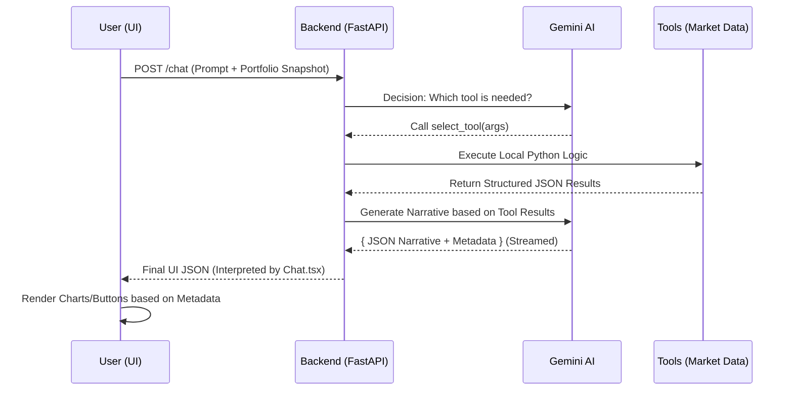

# Foxy Chatbot: Architectural & Capability Guide

This document provides a comprehensive overview of the **Foxy v1** financial co-pilot, detailing its intelligence layer, tool integrations, and the data-driven flow that powers its "expert analyst" persona.

---

## 1. System Overview

Foxy is not just a standard LLM wrapper; it is an **Agentic Financial Orchestrator**. It combines the reasoning power of **Gemini 2.5 Flash** with a suite of local Python tools to provide grounded, real-time market analysis.

### High-Level Flow

1. **User Intent**: The user sends a natural language query.
2. **Context Enrichment**: The frontend attaches a structured "Financial Snapshot" (Holdings, P&L, Health).
3. **Tool Selection**: Foxy evaluates if it needs real-time data or portfolio calculations.
4. **Execution**: The backend runs the requested tools (e.g., fetching technical indicators or calculating portfolio weights).
5. **Narrative Generation**: Foxy synthesizes the tool results into a structured JSON response.
6. **Streaming Delivery**: The response is streamed to the UI, allowing for a dynamic "typing" effect.
7. **Interactive Rendering**: Metadata hints in the response trigger the appearance of charts and summary cards.

---

## 2. Bot Capabilities & Toolset

Foxy has access to several specialized "skills" that it can call upon depending on the conversation's needs.

### A. Market Intelligence (`analyze_ticker`)

- **Capability**: Conducts a deep-dive technical and fundamental audit of any Nifty/Global stock.
- **Data Fetched**: Real-time price, RSI (14-day), MACD, Moving Averages (20/50), Market Cap, PE Ratio, and 52-week ranges.
- **Output**: A specific "Buy/Hold/Sell" decision with data-backed reasoning and a sparkline of recent price action.

### B. Portfolio Health Check (`analyze_full_portfolio`)

- **Capability**: Performs a macro-analysis of the user's entire investment strategy.
- **Data Fetched**: Aggregated P&L, Win Rate, Working Capital Efficiency, and Sector distribution.
- **Output**: A comprehensive "Health Score" (Strong/Fair/Weak) and an "Others" grouping for smaller holdings.

### C. Specific Position Lookup (`get_user_position`)

- **Capability**: Checks if the user owns a specific stock mentioned in the chat.
- **Data Fetched**: Quantity owned and Average Buy Price from the user's uploaded portfolio.
- **Output**: Personalized context (e.g., "Since you bought this at ₹400, your current 20% profit makes this a safe hold").

### D. Market Pulse (`get_market_overview`)

- **Capability**: Fetches the status of major indices like NIFTY 50 and SENSEX.
- **Data Fetched**: Top gainers, top losers, and overall market sentiment.

---

## 3. Data Flow & API Architecture

Foxy utilizes a mix of REST and Streaming architectures to provide a premium user experience.

### API Endpoints Used

| Endpoint             | Method | Purpose                                                                               |
| :------------------- | :----- | :------------------------------------------------------------------------------------ |
| `/chat`              | `POST` | The main engine. Sends message + context; returns a stream of JSON chunks.            |
| `/analyze/{ticker}`  | `GET`  | Used by the UI components to fetch raw chart data for rendering Recharts/Apex panels. |
| `/analyze/portfolio` | `POST` | Used by the Insights page to generate the "Deep Report" logic used by the bot.        |

### The "Snapshot" (Input to AI)

To keep Foxy "portfolio-aware," every request includes:

- **Portfolio Summary**: Total value, overall P&L, and general health metrics.
- **Top 15 Holdings**: A list of symbols, quantities, and average costs.
- **User Identity**: The name or ID of the user for personalization.

### The "Narrative JSON" (Output from AI)

Foxy responds exclusively in a structured JSON schema. This allows the UI to programmatically decide what to show:

- `narrative`: The markdown-formatted text explaining the analysis.
- `metadata`: JSON keys like `tickers` (to show shortcut buttons) and `charts` (to trigger chart renders).
- `sentiment`: Bullish/Bearish/Neutral tags for color-coding the UI.
- `ui_hints`: Instructions for the UI (e.g., `show_chart: true`).

---

## 4. Why Streaming Matters

Foxy uses **Asynchronous Generative Streaming**.

- **Perceived Speed**: Instead of waiting 5-10 seconds for a complex analysis, the user sees Foxy "Thinking" and then "Typing" immediately.
- **Chunk Stitching**: The frontend uses a "Brace Counting" buffer system. It collects partial text chunks and only updates the UI once a complete, valid JSON object is received. This prevents flickering or broken rendering.

---

## 5. Decision Priority Matrix

If Foxy receives an ambiguous question, it follows these priority rules:

1. **Specific Stock > General Portfolio**: If you say "How are my ETERNAL shares?", Foxy will call the ticker analysis tool _and_ fetch your position details rather than giving you a whole-portfolio summary.
2. **Real-time Data > Static Knowledge**: Foxy never guesses prices. It always triggers a tool if a price is needed.
3. **Professional Guidance > Opinions**: Foxy uses the "Decision Engine" logic to ground its advice in technical indicators rather than hallucinations.

---

## Sequence of Operations

